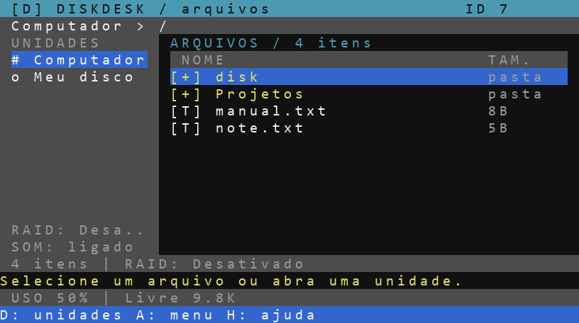

# DiskDesk 3 — Explorador de disquetes para CC: Tweaked

Interface escura com destaque ciano, barra lateral de unidades, ícones, busca e rodapé simplificado: **D: unidades · A: menu · H: ajuda**. O menu A reúne todas as ações, e o botão direito mostra ações do arquivo. Inclui editor de textos, impressão, backup versionado, restauração e transferência wireless.



## Instalar ou atualizar

### Instalador em um arquivo (recomendado)

Use: `wget run https://raw.githubusercontent.com/IcRyn/DiskDesk/main/instalar_diskdesk.lua`

ou

Transfira apenas **`instalar_diskdesk.lua`** para o computador do jogo e execute:

```text
instalar_diskdesk
```

Confirme com **s**. O instalador funciona offline depois de transferido: os quatro módulos Lua já estão embutidos nele. Instala em `/diskdesk-app/`, cria o atalho `/diskdesk.lua`, verifica os arquivos gravados e oferece abrir o programa ao terminar. Use o download acima ou transfira para o computador do jogo; confira o tamanho antes de tentar levar o instalador em um floppy.

Depois, execute **`/diskdesk`** de qualquer pasta (ou `diskdesk` na raiz).

Ao atualizar, a pasta antiga `/diskdesk-app` e o atalho anterior são guardados em `/diskdesk-backup-<identificador>/previous/`. Os arquivos novos são preparados antes de substituir a instalação; se a publicação falhar, tenta restaurar a versão anterior e informa a pasta de recuperação. O instalador não modifica `startup` nem arquivos dos disquetes. Se a energia acabar durante a instalação, consulte essa pasta para recuperação manual.

O instalador ainda precisa ser transferido para o jogo uma vez. Ele ocupa cerca de 127 KiB e cabe por pouco em um floppy vazio de 128 KiB. O download direto é mais simples. Depois de transferido, ele funciona sem HTTP.

### Instalação manual

Copie **os quatro arquivos para a mesma pasta do computador do jogo**:

```text
diskdesk.lua
diskdesk_services.lua
diskdesk_arrays.lua
diskdesk_volumes.lua
```

O pacote `DiskDesk-3.zip` contém o instalador, os quatro módulos e este guia. Extraia no computador real antes de transferir para o Minecraft. Quem instala manualmente deve copiar ou atualizar os quatro módulos juntos; é mais simples executar o instalador atualizado.

Execute no CraftOS:

```text
diskdesk
```

Recomendado: **Advanced Computer** para as cores. Tela mínima 30×12; barra lateral a partir de 45 colunas. Não precisa de outros mods nem bibliotecas extras no jogo. Os scripts Python são testes para o computador real e não fazem parte da instalação.

## Interface e controles

Clique seleciona; duplo clique abre. Botão direito mostra ações do arquivo. O botão **A: menu** no rodapé dá acesso às funções sem precisar memorizar atalhos. O menu A está organizado por categorias e os menus possuem borda ciano. As janelas aceitam clique, setas e Enter; **F1** ou o botão **Voltar** fecha a janela sem encerrar o programa. Esc pode fechar a tela do computador no próprio Minecraft, por isso não é necessário no DiskDesk. Confirmações também aceitam **s** ou **n**.

| Tecla | Ação |
|---|---|
| A | Abrir o menu de ações |
| D | Escolher computador ou disquete |
| Setas / roda | Selecionar arquivo |
| Enter / Backspace | Abrir / voltar uma pasta |
| N / T / E | Nova pasta / novo texto / editar |
| C / M / V | Copiar / marcar para mover / colar no destino |
| R / X ou Delete | Renomear / excluir com confirmação |
| F / F1 | Buscar por nome nesta pasta / limpar busca |
| I | Configurar e consultar RAID 1 |
| L / J | Nomear / ejetar disquete |
| B / O | Criar backup / restaurar backup |
| Z / Y | Compactar em DDZ / extrair DDZ |
| S / G | Enviar / receber arquivo wireless |
| P | Imprimir texto ou continuar impressão |
| U | Ativar / silenciar sons |
| H / Q | Ajuda / sair |

O editor é o `edit` do CraftOS: Ctrl abre Salvar e Sair. Copiar/colar não sobrescreve arquivos existentes; pede outro nome. Para trocar arquivos entre disquetes com um único drive, use o computador como intermediário.

## Boot, armazenamento e ajuda

Ao iniciar o DiskDesk, uma tela de boot mostra o carregamento do explorador e a preparação dos dispositivos. É a abertura do programa, não uma alteração do boot do CraftOS nem do arquivo startup.

**USO** mostra a ocupação do disco atual. **D** abre o painel de armazenamento com porcentagem, barra, espaço livre e capacidade de cada unidade. As barras ficam vermelhas a partir de 90%. Quando a capacidade não está disponível, aparece `--`. Clique na unidade ou use setas e Enter para abri-la. **A → RAID e backup** reúne unidades RAID, backup em vários discos e restauração.

H abre a **Central de ajuda**, dividida por assuntos, com texto ajustado à tela, rolagem, botões de tópicos e navegação por setas. F1 ou Voltar retorna ao explorador.

## Mover arquivos e pastas

Selecione o item, pressione **M**, entre na pasta de destino e use **V**. O item é copiado para um destino temporário e verificado antes de remover a origem, inclusive entre computador e disquetes. Pastas vazias e arquivos binários são preservados. O nome do destino não é sobrescrito: se existir, escolha outro.

Se faltar espaço ou houver falha, a origem fica preservada enquanto a cópia não foi publicada. Pode sobrar um `.partial`. Se a remoção da origem falhar após a publicação, confira os dois locais: a cópia verificada já está no destino. Mantenha os discos inseridos durante a operação.

## Unidade RAID com capacidade conjunta e atualização durante o uso

Use **A → RAID e backup → Unidades RAID em tempo real → Criar unidade RAID**. Escolha RAID 0, 1, 5, 6 ou 1+0, marque os disquetes e dê um nome. A unidade aparece em **D: unidades**, por exemplo **RAID 0 - Trabalho**.

Copie com **C**, ou marque para mover com **M**, abra essa nova unidade e pressione **V**. Os dados são distribuídos automaticamente durante a gravação, sem compactação. O espaço livre e a porcentagem atualizam quando a operação termina. **N/T** cria pastas/textos, **R** renomeia e **Delete** exclui. O original de um movimento só é removido após a cópia verificada.

| Modo | Mínimo | Capacidade útil antes dos índices | Redundância |
|---|---|---|---|
| RAID 0 | 2 | N × tamanho do menor disco | Nenhuma |
| RAID 1 | 2 | Tamanho do menor disco | Uma cópia em cada membro |
| RAID 5 | 3 | (N−1) × tamanho do menor disco | Um membro ausente |
| RAID 6 | 4 | (N−2) × tamanho do menor disco | Dois membros ausentes |
| RAID 1+0 | 4, quantidade par | (N÷2) × tamanho do menor disco | Um ausente por par |

Até oito membros por unidade. Há uma reserva de 8 KiB por membro para índices; os diretórios e índices adicionais também consomem espaço. Arquivos que já estavam na raiz física dos disquetes reduzem o espaço livre, mas **não entram na unidade automaticamente**. Discos de tamanhos diferentes são limitados pelo menor. Os membros não podem pertencer a duas unidades virtuais locais.

Ao editar, o DiskDesk abre um rascunho no computador. **Salvar e sair do editor** publica a alteração nos discos. Se a publicação falhar, informa onde o rascunho foi preservado. A versão nova de um arquivo é preparada antes de substituir a anterior, então alterar um arquivo exige espaço temporário para as duas versões. Se a origem de um movimento estiver num membro quase cheio, passe o arquivo pelo computador antes de colocá-lo na unidade, pois a origem só será removida após a cópia verificada. O limite é de 8 MiB menos um byte por arquivo e 1024 entradas de catálogo, incluindo a raiz; a capacidade física geralmente será menor. Pastas com vários arquivos são processadas arquivo por arquivo.

Se faltar um membro, a unidade permite leitura quando a redundância é suficiente e **bloqueia gravações até a reconstrução**. Use **Gerenciar unidade RAID → Substituir membro ausente**. Retire o membro defeituoso e escolha um disquete substituto com espaço suficiente. RAID 6 pode reconstruir os dois membros ausentes em etapas. **Verificar arquivos / catálogo** identifica arquivos com membros ausentes ou corrompidos e atualiza as cópias do catálogo nos discos.

Use **Excluir unidade RAID** para apagar o catálogo e todos os arquivos internos daquela unidade. Todos os membros precisam estar conectados. A confirmação não remove arquivos físicos que estejam fora da unidade.

As unidades são gerenciadas **dentro do DiskDesk**; não são montagens globais para outros programas do CraftOS. O catálogo ativo fica em `/.diskdesk-volumes/` e cópias dele ficam nos membros, junto aos blocos em `.diskdesk-vdata/`. O instalador preserva esses dados. **Importar unidade dos discos** recupera a unidade em outro computador usando os catálogos e membros disponíveis. Não use a mesma unidade para gravação simultânea por vários computadores.

Uma falha pode deixar blocos temporários ou antigos ocupando espaço. O programa preserva os arquivos confirmados; não apague os arquivos internos manualmente. Se uma cópia redundante do catálogo falhar, o programa avisa: mantenha o catálogo do computador e use Verificar antes de tentar importar em outra máquina.

## Compactar e extrair

Selecione um arquivo ou pasta e use **A → Compactar e extrair**, ou **Z** para compactar e **Y** para extrair. O formato próprio **`.ddz`** preserva nomes, estrutura, pastas vazias e dados binários. Pode compactar uma pasta e enviar o pacote por wireless.

Agora escreve **DDZ2**, com índice binário, números de tamanho variável e referências às pastas pai, evitando repetir os caminhos completos. Comprime índice e conteúdo juntos com LZW quando isso reduz o tamanho; caso contrário guarda essa estrutura binária sem LZW. Continua extraindo os pacotes DDZ1 antigos; versões antigas do DiskDesk não leem DDZ2.

Arquivos muito pequenos ainda podem aumentar porque o pacote guarda nomes, estrutura e checksum. Um teste com uma pasta `pessoal` e dois arquivos `a.txt`/`b.txt` de 8 e 9 bytes verifica que o pacote fica abaixo de 80 bytes, em vez de centenas. O tamanho exato depende dos nomes e do conteúdo. A barra de status informa os tamanhos de entrada/saída e avisa quando o pacote inclui mais bytes de índice do que economizou. Não é ZIP nem remove os originais.

A extração valida caminhos, tamanho e checksum antes de publicar em uma **pasta nova**, sem sobrescrever arquivos existentes. Limites: 512 KiB de conteúdo descompactado, 1024 entradas e cabeçalho de 128 KiB. Espaço adicional é necessário para o pacote ou a extração. Falhas podem deixar um arquivo ou pasta `.partial`.

## Backup com versões

É um **backup versionado por arquivos, iniciado manualmente**. Pode copiar um arquivo ou pasta selecionado no computador, numa unidade RAID ou num disquete. Em um disquete, também oferece copiar a unidade inteira. Cada execução pode usar vários destinos; cada destino recebe uma cópia completa e independente e mantém versões anteriores.

1. Conecte de um a oito discos de destino. Se a origem for outro disquete, conecte-o também. Dê nomes claros com L.
2. Abra o computador, unidade RAID ou disquete e selecione o arquivo ou pasta. Em disquetes, você poderá escolher a unidade inteira.
3. Use **A → RAID e backup → Criar backup** ou pressione B.
4. Marque todos os discos de backup desejados, escolha **Confirmar**, confira os IDs e confirme.
5. Aguarde todas as cópias e verificações. Mantenha a origem e todos os destinos inseridos.

O modo de unidade inteira inclui todo o disquete, mesmo se estiver numa subpasta ou usando busca. O modo de item inclui somente o arquivo ou a pasta selecionada, mantendo seu nome principal. Ambos preservam estrutura, pastas vazias e conteúdo binário. Cada arquivo copiado é relido e comparado por tamanho e checksum Adler-32. O histórico `.diskdesk-backups` não é incluído em novos backups.

As versões ficam no destino em:

```text
.diskdesk-backups/<ID-do-disco-original>/<identificador-da-versao>/
  manifest
  data/
```

Se faltar espaço, remova manualmente versões antigas que não precisa mais ou use outro disquete. Cada versão é uma cópia completa e precisa de espaço adicional para pastas e índice. Limite de 1024 itens e 32 níveis de pastas por backup.

Um backup só aparece em Restaurar depois de concluído. Falhas podem deixar uma pasta `.partial`, que não é tratada como backup válido. Versões anteriores não são alteradas. Remover ou trocar o disco interrompe a operação; o programa confere o ID e o ponto de montagem durante a cópia.

### Restaurar

Abra o disquete que contém os backups, use **A → RAID e backup → Restaurar backup**, escolha a versão e outro disquete como destino. O programa verifica os arquivos e os coloca em uma **nova pasta `Restaurado-...`**, sem substituir arquivos existentes. Depois você pode organizar os arquivos pelo explorador. Em caso de interrupção, uma pasta de restauração `.partial` pode permanecer.

## Transferir arquivos por wireless

Instale o DiskDesk 3 nos dois computadores e conecte um **Wireless Modem** ou **Ender Modem** em cada. Precisam estar ligados e dentro do alcance da conexão; o DiskDesk não instala repetidores.

1. **Destino:** abra a pasta onde quer salvar e use **A → Rede wireless → Receber**. A tela mostra o ID; também está no cabeçalho. Aguarda uma oferta por até 60 segundos, com F1 para cancelar.
2. **Origem:** selecione um arquivo e use **A → Rede wireless → Enviar**. Digite o ID do destino.
3. **Destino:** confira ID do remetente, nome e tamanho e aceite.
4. Aguarde a confirmação. O arquivo aparece na pasta escolhida após ser verificado.

Envia um arquivo por vez, inclusive binários, de até **1 MiB**, em blocos de 8 KiB. Pastas não são enviadas diretamente. Há confirmação dos blocos, tentativas de reenvio e checksum. A aceitação pode levar até cerca de 90 segundos; após iniciada, uma transferência sem progresso por 15 segundos é interrompida.

Se o nome existir, a cópia recebe um sufixo (`arquivo.txt-2`, por exemplo). O arquivo só sai do nome temporário `.partial` após a verificação. Não executa arquivos recebidos. Se faltar a confirmação final, confira o destino antes de reenviar: o arquivo pode já estar salvo.

Rednet não oferece criptografia nem autenticação dos IDs. A confirmação permite escolher ofertas, mas não prova a identidade do remetente. Use em redes de jogadores confiáveis. O checksum detecta erros acidentais; não é uma assinatura de segurança. [Documentação do Rednet](https://tweaked.cc/module/rednet.html).

## Impressora e sons

Conecte uma **Printer**, abasteça com papel e corante, selecione um texto e pressione P. O programa quebra linhas e divide em páginas. Se faltar material ou a saída estiver cheia, reabasteça e tente novamente; pode voltar ao explorador e continuar com P. O trabalho fica na memória: não reinicie nem imprima com outro programa enquanto houver trabalho pendente.

Conecte um **Speaker** para o acorde agudo ao inserir disco e grave ao retirar. Funciona nas perguntas, menus e editor. U silencia até fechar o programa. Sem Speaker, funciona sem áudio.

## Limites e testes

Visualização e impressão aceitam textos até 128 KiB; não interpretam imagens ou PDFs. A interface usa o terminal do computador, não monitor externo. Binários podem ser copiados, incluídos no backup e transferidos por wireless.

Testes com Lua e APIs simuladas incluem transferência com perda de pacotes, DDZ1/DDZ2, discos trocados durante gravação, publicação interrompida, reconstrução em substitutos e todas as duplas de discos ausentes em um RAID 6 de oito membros. RAID 1+0 também testa perdas dentro do mesmo par e entre pares distintos. A prévia vem das escritas reais no terminal simulado, com fonte aproximada. Ainda é necessário validar no Minecraft com periféricos reais.

Referências: [disquetes](https://tweaked.cc/module/disk.html), [arquivos](https://tweaked.cc/module/fs.html), [impressora](https://tweaked.cc/peripheral/printer.html), [Speaker](https://tweaked.cc/peripheral/speaker.html), [modem](https://tweaked.cc/peripheral/modem.html).
